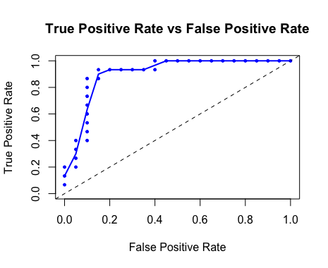
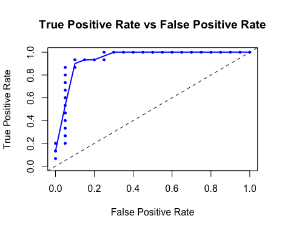

#H2O and the Sonar Data Set

Experimenting with H2O's integration with R and its efficacy on the UCI Sonar Data Set.

 * Training/test split is 80/20.

---

## Gradient Boosting Machine



<p>

```
H2OBinomialMetrics: gbm

MSE:  0.1181879
R^2:  0.5173993
LogLoss:  0.4113014
Mean Per-Class Error:  0.1083333
AUC:  0.9066667
Gini:  0.8133333
```

## Generalized Linear Modeling



<p>


**These numbers are _sick_**

```
H2OBinomialMetrics: glm

MSE:  0.1192669
R^2:  0.5129935
LogLoss:  0.3861887
Mean Per-Class Error:  0.08333333
AUC:  0.9433333
Gini:  0.8866667
Null Deviance:  48.09445
Residual Deviance:  27.03321
AIC:  95.03321
```

## Random Forest


<p>

```
H2OBinomialMetrics: drf

MSE:  0.1082971
R^2:  0.5577867
LogLoss:  0.3574005
Mean Per-Class Error:  0.08333333
AUC:  0.9416667
Gini:  0.8833333
```

## Deep Learning


```
H2OBinomialMetrics: deeplearning

MSE:  0.09352543
R^2:  0.6181045
LogLoss:  0.4602012
Mean Per-Class Error:  0.125
AUC:  0.9433333
Gini:  0.8866667
```

## Who Won?
_Everybody_ is a winner. The performance on this data set is phenomenal. 

* Deep learning wins MSE (0.094)
* Random Forest and Generalized Linear Modeling tie for best per-class error (0.083)
* Random Forest, GLM and Deep Learning in a 3-way tie (two significant digits) for best area-under-curve (0.94)


From the documentation that accompanies the data set, the original researchers to used a neural network with back propogation to get:

```
% Right on test set
84.% / 89.2%
```

Human experts did better
```
Three trained human subjects were each tested on 100 signals, chosen at
random from the set of 208 returns used to create this data set.  Their
responses ranged between 88% and 97% correct.  However, they may have been
using information from the raw sonar signal that is not preserved in the
processed data sets presented here.
```

Both GLM and Random Forest achieve amazing accuracies
 * min_per_class_accuracy 0.90
 * mean_per_class_accuracy 0.92
